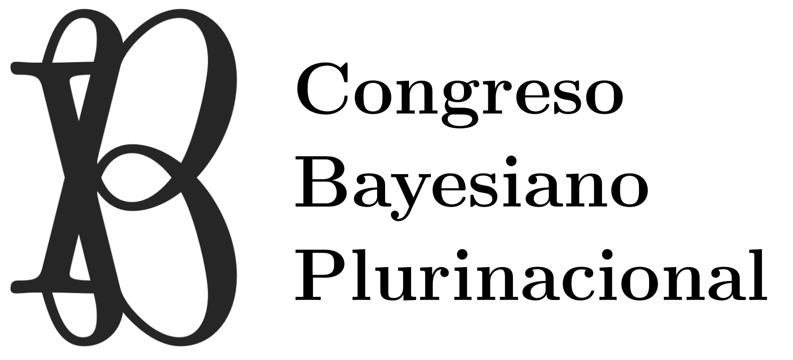

### Acuerdos intersubjetivos en contextos de incertidumbre

A diferencia de las ciencias formales, que validan sus proposiciones dentro de sistemas axiomáticos cerrados, las ciencias empíricas (desde la física hasta las ciencias sociales) deben validar sus proposiciones en sistemas abiertos que por definición contienen siempre algún grado de incertidumbre ¿Es posible alcanzar "verdades" si es inevitable decir "no sé"? Sí. La aplicación estricta de las reglas de la probabilidad (enfoque Bayesiano) garantiza los acuerdos intersubjetivos en contextos de incertidumbre, fundamento de las verdades empíricas. Bajo incertidumbre se hace necesario creer al mismo tiempo en A y no A para que sea la sorpresa, única fuente de información, la que actúe como filtro de las creencias previas. Este proceso de selección (secuencia de filtros) es como el evolutivo (secuencia de reproducción y supervivencia) de naturaleza multiplicativa. Un solo cero en la secuencia genera una extinción irreversible. Por ello existe una ventaja a favor de las formas de vida y de conocimiento empírico que reducen las fluctuaciones por diversificación, cooperación, especialización y coexistencia. Si bien la aplicación estricta de la teoría de la probabilidad ha mostrado ser la lógica ideal en contextos de incertidumbre, su adopción se vio históricamente limitada debido al alto costo computacional asociado. El enfoque Bayesiano, a diferencia del frecuentista, actualiza las creencias de todas y cada una de las hipótesis de acuerdo a la evidencia empírica y formal (datos y modelos causales). Si bien en las últimas décadas las limitaciones computacionales han sido superadas en gran medida gracias al desarrollo de métodos eficientes de aproximación, la inercia histórica es ahora su limitación principal. **La Comunidad Bayesiana Plurinacional tiene por objetivo promover la adopción del enfoque Bayesiano de la probabilidad como método general para alcanzar acuerdos intersubjetivos en contextos de incertidumbre, en la ciencia, la política y la ecología**

### La *Comunidad Bayesiana Plurinacional* organiza

El [**Congreso Bayesiano Plurinacional**.](https://bayesdelsur.com.ar/)
El 4 y 5 se agosto 2023.
Nodo tecnológico, La Banda.
Santiago del Estero, Argentina.

### Apoya el grupo [**Bayes de las Provincias Unidas del Sur**](https://bayesdelasprovinciasunidasdelsur.github.io/)

  
  

---

Contacto `bayesdelsur@gmail.com`
